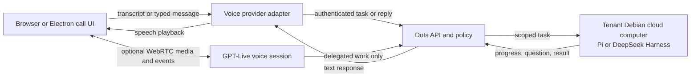
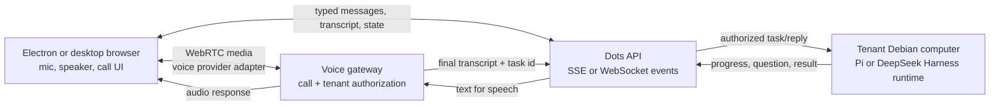

# Dots voice calls: public evidence and Coke Dots design

Updated 2026-10-09 on `feature/voice-technology-architecture`.

## What OpenAI has publicly confirmed

OpenAI's Dots documentation describes product behavior, not the internals of the phone call stack. A user starts a call from the Dot conversation (or the Dot profile in the desktop app), may keep typing while speaking, and may hear a progress update or a question from the Dot. Ending the call closes the voice conversation while previously assigned work can continue. The task uses selected conversation context, which may not be identical to the full context available to background work. The docs do not identify the codec, transport, speech-recognition model, voice model, or audio-retention policy used by Dots.

The Futurepedia V1 video at 06:26 shows the call screen with a Dot avatar/name, elapsed timer, Speaker, End, and Mute buttons. The spoken request is shown in the review video, not as a transcript inside the phone UI. John Aspinall's V2 video shows a call alongside the Dot conversation and context panel at 05:40 and 06:11, with compact microphone and hang-up controls at the conversation's upper right; at 13:58 a “Me: Call ended” event appears in the conversation. These are product observations only; the video does not reveal Dots' network or model implementation.

Sources:

- [OpenAI Dots messaging and voice documentation](https://learn.chatgpt.com/docs/dots/channels)
- [OpenAI Dots tasks and memory](https://learn.chatgpt.com/docs/dots/tasks-and-memory)
- [OpenAI Voice agents](https://developers.openai.com/api/docs/guides/voice-agents)
- [OpenAI WebRTC connection guide](https://developers.openai.com/api/docs/guides/voice-webrtc)
- [Futurepedia, I Tested OpenAI's New Personal Assistant Agent: DOTS](https://www.youtube.com/watch?v=V_1Vn2WfpEY), 06:26
- [John Aspinall, I Tried ChatGPT Dots: Setup, Voice Calls & Real Tasks](https://www.youtube.com/watch?v=Q9tF0R8d_Co), 05:40, 06:11, 07:12, 13:58

## Current Coke Dots call path

The current call is a **chained browser voice path**, not a native speech-to-speech model session:

1. The browser's Web Speech `SpeechRecognition` API opens the microphone and provides a finalized transcript to the page. Audio processing is browser/provider dependent and may use a remote speech service; the Coke Dots task API receives transcript text, not the raw audio, and the application does not persist call audio.
2. Each final phrase goes through the same tenant-authenticated task API as typed work. A clarification uses the existing waiting task ID and task-reply endpoint.
3. While the call remains open, the client polls `/api/state` and follows the task. The independent agent worker continues running if the call closes.
4. Browser `speechSynthesis` reads short acknowledgements, questions, and final task results. Recognition pauses during playback to reduce self-transcription.
5. Mute stops recognition; Speaker stops synthesized playback; End records the call duration and tears down the client call. The regular composer remains available.

This is deterministic enough for mocked Chrome E2E and it connects to the existing Pi/DeepSeek Harness task engines. It is not equivalent to a live full-duplex voice model: recognition and voice quality depend on browser support, the UI cannot cancel remote playback at the model, and polling adds delay. The current E2E injects speech through a fake browser recognizer; it does not claim live microphone or acoustic-quality coverage.

## Current official voice architectures and how they map to Coke Dots

OpenAI's current [Voice agents documentation](https://developers.openai.com/api/docs/guides/voice-agents) presents three architectures; it does not identify the one used by Dots. **GPT-Live** supports full-duplex conversation and delegates reasoning and tool use to a separate backend. That backend can be a client-owned workflow and provider, or an OpenAI-hosted Responses model. **Realtime API** handles speech, reasoning, and tools in one session. A **chained voice pipeline** runs speech-to-text, the application's agent workflow, and text-to-speech as separate stages.

For browser speech-to-speech applications, OpenAI recommends starting with its higher-level Voice Agents interface; its [WebRTC guide](https://developers.openai.com/api/docs/guides/voice-webrtc) describes the lower-level peer-connection path. The guide documents two session setups: a **unified server relay**, where the browser sends its SDP offer to the application server and the server calls OpenAI with its standard API key; or an **ephemeral client secret**, minted by the server and returned to the browser for a direct WebRTC connection. A standard API key remains server-side in both setups. Browser control events can use a WebRTC data channel. The server can also attach a stable, privacy-preserving `OpenAI-Safety-Identifier` when creating the session.

For Coke Dots, **keep the chained flow as the default**: finalized speech becomes ordinary tenant-authenticated task or reply text, so Pi or DeepSeek Harness in the tenant's Debian computer remains the sole task kernel and its existing permissions, Activity history, approvals, and continuation semantics remain authoritative. If a separate OpenAI voice provider is configured later, GPT-Live's client-delegation mode is a documented option for keeping the selected Pi/DSH workflow as the backend while the voice model handles turn-taking and interruption. Give that voice session only a narrow tenant-scoped task/reply tool. A Realtime session that independently reasons and acts is a separate Agent backend and must be configured explicitly; it must not silently replace the selected kernel.

The diagram's GPT-Live route is an optional provider design, not a claim about Dots internals or current Coke Dots behavior. The checked-in implementation currently uses browser speech APIs and the task API; it has no Realtime/GPT-Live client-secret endpoint, WebRTC media session, or OpenAI voice credentials.

## Provider boundary and production requirements

Keep voice as a transport/channel adapter around the existing task system. Do not move the Agent kernel out of the tenant's Debian cloud computer. The browser should own microphone permission and the call controls; the authenticated backend should own call identity, policy, event routing, and any short-lived voice credentials. The tenant's Debian Agent Runtime should continue to own task execution and durable state.

Use a provider interface rather than binding the task kernel to a speech vendor:

- `SpeechInputProvider`: microphone/session setup, turn detection, transcript events, interruption events, stop/cleanup.
- `SpeechOutputProvider`: streaming audio, playback completion, interruption/cancel.
- `VoiceSessionTransport`: call ID, tenant/user authorization, and delivery of typed text and task progress.
- Existing `AgentAdapter`: receives ordinary task instructions or replies and runs inside the tenant Debian computer.

The voice provider and task kernel must remain separate interfaces. A provider may emit final transcript, partial transcript, playback state, interruption, and disconnect events; only an authenticated transcript or explicit typed message should reach the ordinary task/reply API. Pi or DeepSeek Harness remains responsible for agent work. GPT-Live, if enabled later, should receive a narrow delegation tool that creates or updates a tenant-scoped task and streams back progress; it should not receive the cloud computer's direct browser or shell tools.

Security and lifecycle requirements:

- Bind every call, transcript, task, and stream to the authenticated user and tenant; never trust a client-supplied tenant ID.
- Keep long-lived provider keys on the backend. If a WebRTC provider is selected, use the server-side SDP relay or issue only its short-lived client credential/session from a tenant-authorized backend endpoint.
- Don't store audio by default. Store transcript only through the existing task/conversation record and make the retention rule explicit.
- End-call cleanup must stop local tracks, audio playback, event subscriptions, and task polling. It must not cancel the separate agent job unless the user explicitly stops that task.
- Model tests with deterministic audio/transcript fixtures; run a separate manual Chrome/Electron microphone check for permissions, echo cancellation, interruption, network loss, and real device playback.

## UI evidence implementation

The 06:26 source frame is a compressed phone-in-video composite, so these dimensions are relative to the visible handset, not original CSS pixels. The V1 call surface is roughly 0.49:1 width-to-height; it has a graphite bezel, blue/gray gradient, status bar and notch, ring-style Dot avatar/name, large timer, one expand control, and three bottom controls ordered Speaker → End → Mute. V2 shows a separate compact call state beside the conversation: a microphone toggle and red hang-up button at the conversation's upper right. Coke Dots models both observed visual states, selecting the compact state for an active desktop conversation and the handset for standalone call entry; that selection rule is inferred because the footage does not show all entry points in both layouts. Visible transcript/task details remain in the underlying conversation; screen-reader updates retain transcript and task state without adding a text card that is absent from the reference frame.

The expand button is an implementation interaction inferred from its visible icon. No source video frame demonstrates its resulting state; it is marked as unverified rather than treated as a confirmed Dots behavior.
